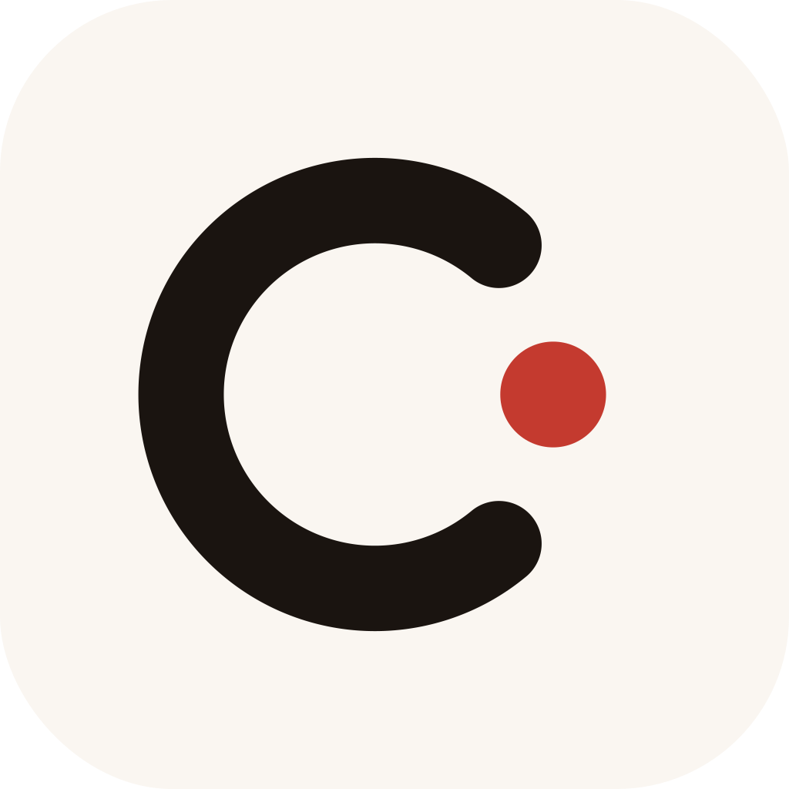

# OpenTeam

  

  中文 | <a href="README.en.md">English</a>

> 本地优先、免费开源、可自我进化的 AI 工作团队。

OpenTeam 不是又一个聊天机器人，也不是把多个 Agent 堆在一起聊天。它把不同模型、不同角色、不同能力的 Agent 组织成一支能互相制约、交叉检查、共同交付的 AI 工作团队。

https://github.com/user-attachments/assets/930440d8-4971-4e92-8d35-a903b6d729b3

## 为什么做这个？

AI Agent 正在从“单个 Bot”走向“AI 团队”。但很多产品里的 Team 只是多个角色轮流说话。

OpenTeam 想做一个更适合真实项目交付的版本：

- **本地优先**：项目文件、上下文、团队记忆优先留在你的电脑上
- **免费开源**：MIT License，不按席位收费，不锁平台
- **多模型协作**：不同 Agent 可以使用不同 Provider / 模型
- **互相检查**：方案、研究、实现、Review、QA 可以彼此制约
- **自我进化**：沉淀项目规则、用户偏好、协作流程和失败教训

## 核心能力

- 自定义 Team、Agent、Provider、模型和 System Prompt
- 通过 `@mention` 让 Agent 之间互相追问、质疑和补充
- 围绕本地 Workspace 保留项目上下文
- 本地 SQLite 持久化房间、消息、Team、Agent 和 Provider 配置
- macOS 桌面版支持签名、公证、DMG 安装和自动更新

## 下载

当前优先支持 macOS Apple Silicon：

- [下载最新 OpenTeam macOS DMG](https://github.com/yulong-me/OpenTeam/releases/latest)

桌面版使用 Electron，前端和后端能力运行在 App 内部，最终用户机器上不暴露 HTTP 服务端口。用户数据保存在系统应用数据目录，升级不会覆盖 SQLite、workspace 或 Provider 配置。

## 配置

在设置页维护：

- **Provider**：CLI 路径、API Key、Base URL、默认模型
- **Agent**：角色名、Provider、模型覆盖、System Prompt、标签
- **Team**：Team 说明、工作流 Prompt、协作规则和验收标准

内置人物专家 prompt 位于 [.agents/skills](./.agents/skills)。

## Roadmap

- Team Memory：沉淀项目规则、用户偏好和历史决策
- Team Playbooks：把研发、调研、写作、发布等流程做成可复用模板
- Evidence Trail：让关键结论关联文件、命令、来源和验证结果
- Windows desktop：继续推进 Windows 打包、签名和自动更新

## License

MIT
