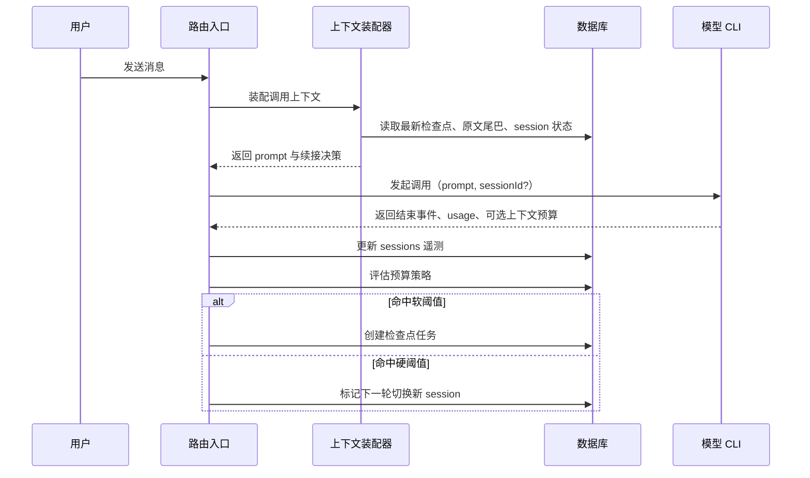

# F024: 长对话上下文检查点与 Session Rollover

> **Status**: spec | **Owner**: codex | **Priority**: P1

## Why

OpenTeam 现在对长对话的处理还不稳定：

1. 运行时显式注入的历史主要还是“最近几条消息”，缺少真正的长程记忆装配。
2. Claude / OpenCode 的 `sessionId` 会持续续接，但应用层并不知道 provider 内部何时压缩、何时接近窗口上限。
3. 当前 `sessionId` 的恢复链路并不完整，长房间在重启后也缺少明确的上下文续接策略。

结果是：房间消息一长，系统只能在“继续喂全文”和“不断压缩同一个 session”之间摇摆。这个 Feature 的目标是把策略收敛成一句话：

**原始消息永远保存；运行时只装配当前任务 + 检查点 + 少量原文尾巴；一旦接近窗口上限，就生成检查点并开启新 session。**

同时，session 本身不能被当成“可以无限工作下去的记忆容器”。如果一个 agent 长时间挂在同一个 session 上持续 `resume`，provider 内部压缩会越来越重，最终上下文质量会下降。因此，session rollover 不只是后台机制，也需要在 UI 上被明确表达出来。

## 需求点 Checklist

| ID | 需求点（铲屎官原话/转述） | AC 编号 | 验证方式 | 状态 |
|----|---------------------------|---------|----------|------|
| R1 | 房间长对话不能靠“同一个 session 一直压缩”硬撑 | AC-A1, AC-B1, AC-B2 | test / manual | [ ] |
| R2 | Agent CLI 如果返回上下文长度，应能直接用来触发 rollover | AC-A2, AC-B2 | test / manual | [ ] |
| R3 | 就算 provider 没返回 context metrics，系统也要能工作 | AC-B3 | test | [ ] |
| R4 | 要有明确的表结构、状态流和调用边界，避免继续把逻辑藏在 provider session 里 | AC-A1, AC-A2, AC-A3, AC-B4 | review / manual | [ ] |
| R5 | Agent 需要时应能主动翻找房间历史，而不是只能被动吃摘要 | AC-B5 | test / manual | [ ] |
| R6 | Checkpoint 在用户界面要有明确体现，让用户知道系统已经形成阶段小结 | AC-B6 | screenshot / manual | [ ] |
| R7 | 右侧 Agent 面板要显示 session epoch 轨迹：每次 rollover 新增一个圆圈；当前圆圈外环表示上下文还剩多少 | AC-A5, AC-B7 | screenshot / manual / test | [ ] |

### 覆盖检查
- [ ] 每个需求点都能映射到至少一个 AC
- [ ] 每个 AC 都有验证方式
- [ ] 前端需求已准备需求→证据映射表（若适用）

## What

### Phase A: 检查点与 Session 遥测落库

把“长对话管理”先变成可观测、可持久化的数据层：

- 原始 `messages` 继续作为唯一真相源，不做覆盖式摘要。
- `sessions` 表从“只存 session_id”升级为“存 session + 预算遥测 + rollover 标记”。
- 新增 `session_epochs` 表，追加保存每个 agent 的 session 代际历史，而不是只覆盖当前 session。
- 新增 `context_checkpoints` 表，存房间级检查点。
- provider 如果返回 `context limit / used / remaining`，统一接入；如果没有，保留为空，后续走本地估算。
- `sessionId` 的 in-memory / DB 键统一使用稳定 `agent.id`，不再使用 `agentName`。

Phase A 不改变最终 prompt 内容，只先把需要的状态收齐。

### Phase B: 上下文装配与 Session Rollover

把调用入口从“最近几条 transcript”升级为真正的上下文装配器：

- 新增 `assembleInvocationContext()`，统一拼接：
  - 当前任务
  - team / agent prompt
  - 最新房间检查点
  - 检查点之后的少量原文尾巴
- 新增按需查历史能力：agent 默认先使用 checkpoint；只有在信息不足时，才主动检索房间历史并拉取局部原文窗口。
- 新增用户可见的 Checkpoint 表达：时间线里出现检查点卡片，顶栏显示最近检查点状态，让用户理解系统不是“凭空失忆”。
- 新增用户可见的 Session Epoch 表达：右侧 Agent 面板中，每个 agent 显示一组 session 圆圈；每次 rollover 都新增一个新圆圈，当前圆圈外环显示上下文剩余比例。
- 移除“新 agent 首次发言直接吃完整房间历史”的分支。
- 增加预算策略：
  - 软阈值：生成新检查点
  - 硬阈值：下一轮不再 `resume` 老 session，而是用最新检查点开启新 session
- provider 没有返回上下文长度时，回退到“prompt 估算 + 最近几轮 input_tokens”策略。

Phase B 的目标不是做语义检索，而是先把长对话从“无限续杯”改成“分期结账”。

## Design

### 数据边界

- `messages`：永久真相源
- `context_checkpoints`：派生记忆，不覆盖原消息
- `sessions`：某个 room + agent 当前活跃 session 的运行状态
- `session_epochs`：某个 room + agent 的历史 session 轨迹，供 UI 和诊断使用

### 表结构

#### 1. 扩展 `sessions`

```sql
ALTER TABLE sessions ADD COLUMN provider TEXT;
ALTER TABLE sessions ADD COLUMN epoch INTEGER NOT NULL DEFAULT 1;
ALTER TABLE sessions ADD COLUMN last_input_tokens INTEGER;
ALTER TABLE sessions ADD COLUMN last_output_tokens INTEGER;
ALTER TABLE sessions ADD COLUMN context_limit_tokens INTEGER;
ALTER TABLE sessions ADD COLUMN context_used_tokens INTEGER;
ALTER TABLE sessions ADD COLUMN context_remaining_tokens INTEGER;
ALTER TABLE sessions ADD COLUMN context_utilization REAL;
ALTER TABLE sessions ADD COLUMN rollover_after_message_id TEXT;
ALTER TABLE sessions ADD COLUMN updated_at INTEGER NOT NULL DEFAULT 0;
```

字段说明：

| 字段 | 用途 |
|------|------|
| `agent_id` + `room_id` | 主键；必须是稳定 ID，不再传 `agentName` |
| `session_id` | provider 续接 ID |
| `epoch` | 当前是第几代 session |
| `last_input_tokens` / `last_output_tokens` | 最近一轮调用返回的 usage |
| `context_*` | provider 若返回上下文预算，则落库 |
| `rollover_after_message_id` | 非空表示“下一轮需要切新 session” |
| `updated_at` | 遥测更新时间 |

#### 2. 新增 `session_epochs`

```sql
CREATE TABLE IF NOT EXISTS session_epochs (
  id                        TEXT PRIMARY KEY,
  room_id                   TEXT NOT NULL,
  agent_id                  TEXT NOT NULL,
  epoch                     INTEGER NOT NULL,
  session_id                TEXT NOT NULL,
  status                    TEXT NOT NULL,
  context_limit_tokens      INTEGER,
  context_remaining_tokens  INTEGER,
  context_utilization       REAL,
  rollover_reason           TEXT,
  started_at                INTEGER NOT NULL,
  closed_at                 INTEGER,
  FOREIGN KEY (room_id) REFERENCES rooms(id)
);

CREATE INDEX IF NOT EXISTS idx_session_epochs_room_agent_started
ON session_epochs(room_id, agent_id, started_at ASC);
```

字段说明：

| 字段 | 用途 |
|------|------|
| `agent_id + room_id + epoch` | 标识某个 agent 在某个 room 的第几代 session |
| `session_id` | provider 真实 session 标识 |
| `status` | `active` / `rolled_over` / `abandoned` |
| `context_*` | 记录该 epoch 最近一次遥测，供 UI 圆圈进度显示 |
| `rollover_reason` | `soft_limit` / `hard_limit` / `manual` / `provider_reset` |
| `started_at` / `closed_at` | 用于排序和 UI 时间表达 |

#### 3. 新增 `context_checkpoints`

```sql
CREATE TABLE IF NOT EXISTS context_checkpoints (
  id                    TEXT PRIMARY KEY,
  room_id               TEXT NOT NULL,
  from_message_id       TEXT,
  to_message_id         TEXT NOT NULL,
  summary_md            TEXT NOT NULL,
  facts_json            TEXT NOT NULL DEFAULT '[]',
  decisions_json        TEXT NOT NULL DEFAULT '[]',
  open_questions_json   TEXT NOT NULL DEFAULT '[]',
  artifacts_json        TEXT NOT NULL DEFAULT '[]',
  source_message_count  INTEGER NOT NULL,
  token_estimate        INTEGER,
  trigger_reason        TEXT NOT NULL,
  created_at            INTEGER NOT NULL,
  FOREIGN KEY (room_id) REFERENCES rooms(id)
);

CREATE INDEX IF NOT EXISTS idx_context_checkpoints_room_created
ON context_checkpoints(room_id, created_at DESC);
```

字段说明：

| 字段 | 用途 |
|------|------|
| `from_message_id` / `to_message_id` | 该检查点覆盖的消息区间 |
| `summary_md` | 给模型读的压缩正文 |
| `facts_json` | 稳定事实 |
| `decisions_json` | 已决事项 |
| `open_questions_json` | 未决问题 |
| `artifacts_json` | 关键文件/产物引用 |
| `trigger_reason` | `soft_limit` / `hard_limit` / `manual` / `report` |

### 检查点正文格式

`summary_md` 保持固定结构，避免“摘要越来越散”：

```md
## 房间进展
## 稳定事实
## 已决策事项
## 未决问题
## 关键产物
## 给下一轮专家的最小背景
```

### 状态流

| 状态 | 含义 | 进入条件 | 离开条件 |
|------|------|----------|----------|
| `NORMAL` | 正常续接当前 session | 默认 | 命中软/硬阈值 |
| `CHECKPOINT_PENDING` | 需要生成新检查点 | 命中软阈值 | 检查点生成完成 |
| `ROLLOVER_PENDING` | 下一轮必须切新 session | 命中硬阈值 | 新 epoch 启动完成 |
| `FRESH_EPOCH` | 已切换到新 session | 完成 rollover | 后续再次命中阈值 |

### 调用时序



### 预算策略

#### 优先使用 provider metrics

如果 provider 返回以下任一组信息，则直接使用：

- `context_limit_tokens`
- `context_used_tokens`
- `context_remaining_tokens`
- `context_utilization`

推荐阈值：

| 阈值 | 默认值 | 动作 |
|------|--------|------|
| 软阈值 | `utilization >= 0.60` | 生成检查点 |
| 硬阈值 | `utilization >= 0.80` 或 `remaining <= 20%` | 标记下一轮 rollover |

#### 缺失 metrics 时的回退策略

若 provider 没返回上下文预算，则使用：

```text
estimatedPromptTokens
+ movingAverage(last N input_tokens)
+ latestCheckpoint.token_estimate
```

命中阈值的最小策略：

- 最近 20 条新消息仍无检查点 → 生成检查点
- 连续同一 session 25 轮以上 → 下一轮 rollover
- 单次 `input_tokens` 异常跃升 → 生成检查点

### Prompt 装配规则

统一替换现有“`slice(-10)` transcript”策略：

```text
team workflow prompt
+ agent prompt
+ 当前任务
+ 最新 room checkpoint
+ checkpoint 之后的相关原文尾巴
```

“相关原文尾巴”优先级：

1. checkpoint 之后的用户消息
2. 直接发给当前 agent 的消息
3. 当前 agent 最近一次输出
4. 最近少量公共消息

明确不再支持：

- 新 agent 首次发言直接吃完整房间历史
- 单纯依赖 provider session 自己压缩

### History Retrieval（按需查历史）

Checkpoint 负责给 agent 提供“大局背景”，但某些问题需要回看旧记录里的细节。

因此 Phase B 增加一个最小的按需查历史层，原则是：

- 默认先看 checkpoint，不直接翻整段历史
- 只有模型判断“当前信息不足”时，才触发检索
- 检索命中后，再读取一小段局部原文窗口
- 单轮检索次数受限，避免 agent 陷入“无限翻档案”

#### 最小接口

```ts
getLatestCheckpoint(roomId)
searchRoomHistory(roomId, query, limit)
getMessageWindow(roomId, anchorMessageId, before, after)
```

#### 使用规则

1. 每轮调用默认不检索历史，先依赖：
   - 当前任务
   - 最新 checkpoint
   - 最近原文尾巴
2. 若 agent 明确缺少某个细节，可调用 `searchRoomHistory()`。
3. 搜索结果只返回少量命中；agent 若要看上下文，再调用 `getMessageWindow()`。
4. 单轮最多允许 1 到 3 次历史检索。
5. 只检索当前 room，不跨房间串查。

#### 典型情况

- “为什么方案 A 之前被否了？”
- “这个迁移步骤是谁提出来的？”
- “某个关键文件上次讨论时提到过什么？”

这类问题不适合把全量历史重新塞进 prompt，更适合：

```text
先看 checkpoint
→ 发现细节不够
→ 搜关键词
→ 读命中消息前后几条
→ 再继续回答
```

### UI 表达（让用户看见 Checkpoint）

Checkpoint 不应该只是后台机制，用户界面也要明确表达“这里已经形成了一次阶段小结”。

#### 目标

- 用户能在时间线上看到：系统在哪个时点生成了 checkpoint
- 用户能理解：后续 agent 回答会基于这个阶段小结继续
- 用户不会误以为模型“忘记前文”或“突然换了脑子”

#### 最小 UI 方案

##### 1. 时间线里的 Checkpoint 卡片

在消息列表中插入系统卡片，位置在 checkpoint 覆盖区间之后。

卡片内容：

- 标题：`阶段检查点`
- 副标题：`已整理前 24 条消息`
- 摘要预览：显示 `summary_md` 前 2 到 4 行
- 元信息：
  - 生成原因：`上下文接近上限` / `准备切换新 session` / `手动生成`
  - 生成时间
  - 所属 epoch（可选，默认折叠）

主要操作：

- `展开查看摘要`
- `查看覆盖范围`

##### 2. 顶栏状态提示

房间顶栏增加一个轻量状态：

```text
最近检查点：2 分钟前
```

点击后打开一个小面板，展示：

- 最近一次 checkpoint 时间
- 覆盖了多少条消息
- 当前是否已切换到新 session / 新 epoch

##### 3. 不做“调试面板式”暴露

默认 UI 不直接展示原始 token 数、复杂 provider 指标或内部字段名。

对普通用户只表达两件事：

- 系统刚刚帮你整理了一次阶段小结
- 后续回答会基于这个小结继续

需要更深的诊断信息时，再考虑 Debug 面板承载。

#### 用户看到的典型效果

```text
[系统卡片]
阶段检查点
已整理前 24 条消息，后续专家将基于这次小结继续协作。
[展开查看摘要]
```

如果随后发生 rollover，可以在下一条系统提示里轻量表达：

```text
已切换到新的上下文阶段，历史小结已保留。
```

### UI 表达（让用户看见 Session Epoch）

右侧 Agent 面板除了“状态点 + 名字”，还要表达这个 agent 已经经历了多少轮 session，以及当前这一轮还剩多少上下文预算。

#### 目标

- 用户能看见：这个 agent 是否还在同一个 session 上工作
- 用户能理解：每次 rollover 会产生新的上下文阶段，而不是“同一个脑子无限压缩”
- 用户能直观看到：当前活跃 session 还剩多少上下文空间

#### 最小 UI 方案

在右侧 `AgentPanel` 的每个 agent 行中显示：

- `状态点`
- `名字`
- `session 圆圈组`

示意：

```text
● 架构师        ○ ○ ◔
● Reviewer      ○ ◕
○ 测试工程师    ◌
```

含义：

- 每个圆圈代表一个 `session epoch`
- 已结束的历史 session 显示为静态圆圈
- 当前活跃 session 显示为带外环进度的圆圈
- 外环表示 `context_remaining_tokens / context_limit_tokens`

颜色建议：

- `remaining > 50%`：绿色
- `20% - 50%`：黄色
- `< 20%`：红色
- 无 metrics：灰色空环

#### 交互

- hover 当前圆圈时显示：
  - `Session 3`
  - `12k / 20k remaining`
  - `started 8 分钟前`
- hover 历史圆圈时显示：
  - `Session 1`
  - `rolled over`
  - `closed 12 分钟前`

#### 行为规则

1. agent 第一次在 room 中执行时，创建 `epoch=1` 圆圈。
2. 当前 session 遥测更新时，只更新最后一个活跃圆圈的外环。
3. 发生 rollover 时：
   - 当前圆圈冻结为历史圆圈
   - 新增一个新圆圈作为 `epoch+1`
4. 右侧面板默认最多显示最近 6 个圆圈；更早的 epoch 折叠成 `+N`

#### 为什么要做成“每个 session 一个圆圈”

因为 session rollover 本身就是系统在对抗长对话上下文压缩的一部分。

如果 UI 只显示“当前还剩多少”，用户看不到：

- 这个 agent 是否已经滚动过多轮 session
- 为什么系统会突然切到新 session
- 长房间里上下文是否正在持续被压缩

把 epoch 轨迹显式画出来，能把“后台记忆管理”变成用户可理解的系统行为。

### 伪代码

```ts
function assembleInvocationContext(roomId: string, agentId: string, task: string) {
  const session = sessionsRepo.get(roomId, agentId)
  const checkpoint = checkpointsRepo.getLatest(roomId)
  const tail = messagesRepo.listTailAfterCheckpoint(roomId, checkpoint?.to_message_id, {
    targetAgentId: agentId,
    limit: 12,
  })

  const prompt = [
    buildTeamPrompt(roomId),
    buildAgentPrompt(agentId),
    `【当前任务】${task}`,
    checkpoint ? checkpoint.summary_md : null,
    renderRawTail(tail),
  ].filter(Boolean).join('\n\n')

  const shouldResume = !session?.rollover_after_message_id
  return { prompt, sessionId: shouldResume ? session?.session_id : undefined }
}

function maybeLookupHistory(roomId: string, agentId: string, question: string) {
  if (!needsHistoryLookup(question)) return null

  const hits = searchRoomHistory(roomId, buildHistoryQuery(question), 3)
  if (hits.length === 0) return null

  return getMessageWindow(roomId, hits[0].messageId, 3, 3)
}

function onProviderRunEnd(roomId: string, agentId: string, event: ProviderEndEvent) {
  sessionsRepo.upsertTelemetry(roomId, agentId, {
    sessionId: event.sessionId,
    inputTokens: event.input_tokens,
    outputTokens: event.output_tokens,
    contextLimitTokens: event.context_limit_tokens,
    contextUsedTokens: event.context_used_tokens,
    contextRemainingTokens: event.context_remaining_tokens,
    contextUtilization: event.context_utilization,
  })

  const policy = evaluateBudget(roomId, agentId, event)
  if (policy.createCheckpoint) enqueueCheckpointJob(roomId, policy.reason)
  if (policy.requireRollover) sessionsRepo.markRolloverPending(roomId, agentId, policy.afterMessageId)
}

function onSessionEpochTransition(roomId: string, agentId: string, session: SessionState, event: ProviderEndEvent) {
  sessionEpochsRepo.upsertCurrent({
    roomId,
    agentId,
    epoch: session.epoch,
    sessionId: event.sessionId,
    contextLimitTokens: event.context_limit_tokens,
    contextRemainingTokens: event.context_remaining_tokens,
    contextUtilization: event.context_utilization,
    status: 'active',
  })

  if (session.rolloverAfterMessageId) {
    sessionEpochsRepo.closeEpoch(roomId, agentId, session.epoch, {
      reason: 'hard_limit',
      closedAt: Date.now(),
    })
    sessionEpochsRepo.insertNew({
      roomId,
      agentId,
      epoch: session.epoch + 1,
      sessionId: '',
      status: 'active',
      startedAt: Date.now(),
    })
  }
}

function evaluateBudget(roomId: string, agentId: string, event: ProviderEndEvent) {
  if (event.context_utilization !== undefined) {
    return {
      createCheckpoint: event.context_utilization >= 0.60,
      requireRollover: event.context_utilization >= 0.80,
      reason: 'provider_metric',
      afterMessageId: currentLastMessageId(roomId),
    }
  }

  const heuristic = estimateBudgetFromHistory(roomId, agentId)
  return {
    createCheckpoint: heuristic.softExceeded,
    requireRollover: heuristic.hardExceeded,
    reason: 'heuristic',
    afterMessageId: currentLastMessageId(roomId),
  }
}
```

## Acceptance Criteria

### Phase A（检查点与 Session 遥测落库）
- [ ] AC-A1: `sessionId` 在内存态与 DB 态统一使用稳定 `agent.id` 作为键；服务重启后可从 `sessions` 正确恢复，不再回退为 `sessionIds: {}`。
- [ ] AC-A2: provider 统一 `end` 事件支持可选的 `context_limit_tokens / context_used_tokens / context_remaining_tokens / context_utilization`；缺失时允许为空。
- [ ] AC-A3: 新增 `context_checkpoints` 表并落库房间级检查点，包含消息区间、结构化摘要和触发原因。
- [ ] AC-A4: 原始 `messages` 继续完整保存，检查点生成不会覆盖或删除任何原消息。
- [ ] AC-A5: 新增 `session_epochs` 追加式记录；每次 rollover 都会保留旧 epoch，并为新 epoch 创建独立记录。

### Phase B（上下文装配与 Session Rollover）
- [ ] AC-B1: agent 调用前统一走 `assembleInvocationContext()`，输入至少包含“当前任务 + 最新检查点 + 原文尾巴”；移除“新 agent 首次发言读完整房间历史”的逻辑。
- [ ] AC-B2: 命中硬阈值后，下一轮调用不再续接旧 `sessionId`，而是基于最新检查点开启新的 `epoch`。
- [ ] AC-B3: 当 provider 没返回 context metrics 时，系统仍可基于启发式估算触发检查点与 rollover。
- [ ] AC-B4: 后端日志 / 审计中可明确看到检查点生成与 rollover 的触发原因（provider metric 或 heuristic）。
- [ ] AC-B5: agent 默认依赖 checkpoint 和原文尾巴工作；只有在信息不足时才可调用历史检索接口，并且单轮检索次数受限。
- [ ] AC-B6: 用户界面可明确看到 checkpoint 的生成时点与摘要入口；至少包含消息流中的 checkpoint 卡片和顶栏最近检查点状态。
- [ ] AC-B7: 右侧 Agent 面板可显示每个 agent 的 session epoch 圆圈组；当前圆圈外环展示上下文剩余比例，发生 rollover 后会新增圆圈而不是复用同一个 session 表达。

## Dependencies

- **Evolved from**: F018（把“按 token 预算做 Context Assembly”的方向落成真实数据结构与运行策略）
- **Blocked by**: 无
- **Related**: F021（持久化基础）、F052（Team workflow 注入）、F014（长运行容错与恢复）

## Risk

| 风险 | 缓解 |
|------|------|
| 检查点摘要失真，导致模型遗漏事实 | 原始消息仍是唯一真相源；检查点正文固定结构；保留原文尾巴 |
| 过早 rollover，导致 provider session 的隐式记忆丢失 | 先软阈值生成检查点，再硬阈值 rollover；下一轮切换前确认已有最新检查点 |
| provider 不稳定返回 context metrics | 全部字段设计为 optional；始终保留 heuristic fallback |
| 迁移后 session 键不一致 | 统一改为稳定 `agent.id`，并补重启恢复测试 |

## Open Questions

| # | 问题 | 状态 |
|---|------|------|
| OQ-1 | `context_utilization` 的默认阈值是否应按 provider 区分？ | ⬜ 未定 |
| OQ-2 | 检查点生成是同步阻塞下一轮，还是后台异步预生成？ | ⬜ 未定 |
| OQ-3 | 顶栏是否要默认展示当前 epoch，还是只在展开面板里显示？ | ⬜ 未定 |
| OQ-4 | 右侧面板默认展示多少个历史 session 圆圈，超过后如何折叠？ | ⬜ 未定 |

## Key Decisions

| # | 决策 | 理由 | 日期 |
|---|------|------|------|
| KD-1 | 原始消息保留为唯一真相源，检查点只是派生层 | 防止“摘要覆盖历史”导致不可追溯 | 2026-04-21 |
| KD-2 | 先做 room 级 checkpoint，不在本期引入 agent 私有记忆表 | 降低复杂度，先解长对话主矛盾 | 2026-04-21 |
| KD-3 | 优先使用 provider 返回的 context metrics，但不能依赖其存在 | 不同 CLI 能力不一致，必须有 fallback | 2026-04-21 |
| KD-4 | Rollover 只在“已有最新 checkpoint”前提下执行 | 防止切新 session 时丢失语义背景 | 2026-04-21 |

## Timeline

| 日期 | 事件 |
|------|------|
| 2026-04-21 | 立项，定义 room checkpoint + session telemetry + rollover 策略 |

## Review Gate

- Phase A: 后端数据模型和迁移策略 review
- Phase B: Prompt 组装结果与 rollover 阈值策略 review

## Links

| 类型 | 路径 | 说明 |
|------|------|------|
| **Feature** | `docs/features/F018-mainflow-prompt-ux.md` | 提出了“按 token 预算做 Context Assembly”的方向 |
| **Feature** | `docs/features/F021-database-persistence.md` | 本 Feature 依赖其持久化基础 |
| **Feature** | `docs/features/F014-agent-process-resilience.md` | 长运行和恢复体验相关 |
