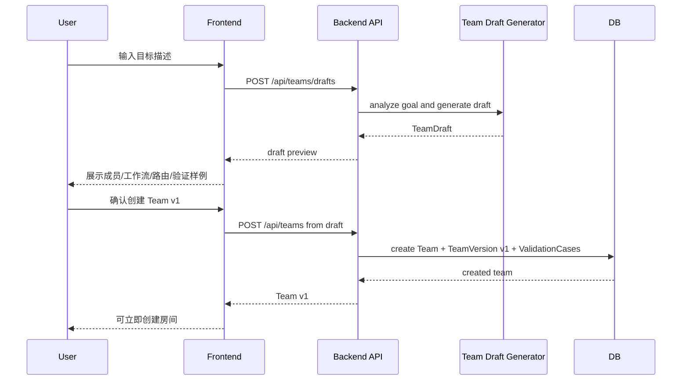

# F055: Goal-to-Team Creation（用目标描述创建团队）

> **Status**: implemented | **Owner**: codex | **Priority**: P1

## Why

F052-F054 已经让 OpenTeam 的核心对象稳定为可版本化、可进化、可验证的 Team。但用户第一次创建自定义 Team 时，仍然不应该被迫理解成员 prompt、协作协议、路由策略和验证样例这些内部结构。

这个 Feature 的目标是把“手动搭团队”变成：

> 用户只描述目标，系统自动分析任务领域，生成 Team 名称、成员组成、成员提示词、团队工作流、路由策略和初始验证样例；用户审阅后确认，成为 Team v1。

这里的“手动创建”指用户主动发起创建，而不是手动填写每个 agent / prompt 字段。

## 需求点 Checklist

| ID | 需求点（铲屎官原话/转述） | AC 编号 | 验证方式 | 状态 |
|----|---------------------------|---------|----------|------|
| R1 | 手动创建团队，但用户只需要描述目标 | AC-A1, AC-A2 | test / tsc | [x] |
| R2 | 系统自动分析目标，建立 agent 组成 | AC-B1, AC-B2 | test | [x] |
| R3 | 系统自动生成成员提示词和团队工作流提示词 | AC-B3, AC-B4 | test / review | [x] |
| R4 | 生成结果必须可审阅，不能悄悄落库成不可解释配置 | AC-C1, AC-C2 | test / tsc | [x] |
| R5 | 确认后创建 Team v1，并能直接用于新房间 | AC-D1, AC-D2 | test / tsc | [x] |

### 覆盖检查
- [x] 每个需求点都能映射到至少一个 AC
- [x] 每个 AC 都有验证方式
- [x] 前端需求已准备需求→证据映射表

## What

### Phase A: Goal Intake（目标输入）

新增“创建 Team”入口，主路径只有一个必填输入：

```text
你希望这支 Team 帮你完成什么？

示例：
- 帮我做一个软件功能，从需求澄清、方案设计、实现、review 到验收
- 帮我研究一个新产品方向，输出竞品分析、机会判断和执行计划
- 帮我写一篇技术文章，先做资料梳理，再搭结构，再写正文，再审稿
```

系统可以提供可选高级项，但不能让它们成为创建门槛：

- 偏好的交付物类型
- 是否需要代码执行 / 文件编辑
- 是否需要验证样例
- 期望团队规模上限

默认体验必须成立：用户只填目标描述，也能生成一支可工作的 Team。

### Phase B: Team Draft Generation（生成团队草案）

系统根据目标描述生成一个 **Team Draft**，不是直接创建正式 Team。

```text
TeamDraft
= name
+ mission
+ members[]
+ workflow
+ teamProtocol
+ routingPolicy
+ teamMemory[]
+ validationCases[]
+ generationRationale
```

每个 member 至少包含：

```text
MemberDraft
= displayName
+ role
+ responsibility
+ systemPrompt
+ whenToUse
+ providerPreference?
```

生成规则：

- 成员数量默认 3-5 个，除非目标明显更简单或更复杂。
- 每个成员必须有清晰职责边界，避免“全能专家”重复堆叠。
- `workflow` 描述团队如何从输入推进到交付。
- `teamProtocol` 描述成员协作规则、交接标准、何时需要用户确认。
- `routingPolicy` 描述什么情况下叫哪个成员。
- `teamMemory` 只放初始共识，不放运行后经验。
- `validationCases` 生成 2-4 个初始 checklist case，用于 F054 preflight。

生成结果必须带 `generationRationale`，解释为什么需要这些成员和流程。

### Phase C: Draft Review（用户审阅草案）

生成后进入 Team Draft 审阅页，而不是立即落库。

用户能看到：

- Team 名称和 mission
- 成员列表：职责、何时使用、system prompt 摘要
- 团队工作流
- 路由策略
- 初始 validation cases
- 系统生成理由

用户可以执行：

- `创建 Team v1`
- `重新生成`
- `编辑草案`
- `取消`

V1 可以先支持轻量编辑：

- 改 Team 名称
- 删除成员
- 修改成员职责 / prompt
- 修改 workflow / routing policy
- 删除 validation case

如果用户不编辑，直接确认也应该可用。

### Phase D: Create Team v1（确认后落库）

用户确认后才创建正式 Team 和不可变 TeamVersion v1。

落库映射：

| Draft 字段 | 落库目标 |
|------------|----------|
| `name` / `mission` | Team |
| `members[]` | TeamVersion member snapshot |
| `workflow` | TeamVersion workflow |
| `teamProtocol` | TeamVersion teamProtocol |
| `routingPolicy` | TeamVersion routingPolicy |
| `teamMemory[]` | TeamVersion teamMemory |
| `validationCases[]` | ValidationCase，关联 Team v1 |

V1 推荐把生成成员作为 TeamVersion 内的成员快照，不立即污染全局 Agent Catalog。后续如果需要复用某个成员，再做“提升为全局 Agent”的独立功能。

创建成功后，用户可以：

- 立即用该 Team 创建新房间
- 留在 Team 设置页继续微调
- 看到 `Team 名称 · v1`

### Phase E: Safety and Explainability（安全与可解释性）

系统生成 prompt 时必须遵守：

- 不生成要求绕过用户确认、自动合并 EVO、自动提交代码的规则。
- 不把目标描述中的敏感或危险要求升级成更强能力。
- 对不明确目标返回澄清建议，而不是胡乱生成 Team。
- 对高风险目标显示风险提示，并要求用户补充边界。
- Draft 生成失败时保留用户输入，不丢失目标描述。

## User Experience

### 新入口

在创建房间或 Team 管理入口增加：

```text
[新建 Team]
```

点击后打开 Goal-to-Team 创建流程：

```text
创建 Team

你希望这支 Team 帮你完成什么？
[ 多行输入框 ]

[生成 Team 草案]
```

### 生成中状态

```text
正在分析目标
正在规划成员职责
正在生成团队工作流
正在生成初始验证样例
```

### 草案审阅

```text
软件交付团队 · Draft

Mission
从需求澄清到实现验收，交付可运行、可 review 的软件改动。

Members
- 产品澄清员：收敛需求和验收标准
- 架构设计师：拆方案和风险
- 实现工程师：修改代码并运行验证
- Reviewer：检查 bug、回归和验收缺口

Workflow
1. 澄清目标和边界
2. 拆方案和验证点
3. 实现
4. Review
5. 修复
6. 汇报用户可验证变化

[重新生成] [编辑草案] [创建 Team v1]
```

## Sequence



## Acceptance Criteria

### Phase A（目标输入）
- [x] AC-A1: 用户可以从 Team/Room 入口打开“新建 Team”流程
- [x] AC-A2: 创建流程只有目标描述是必填项，不要求用户手写 agent prompt
- [x] AC-A3: 目标描述为空或过短时，系统给出可操作提示，不创建草案

### Phase B（生成团队草案）
- [x] AC-B1: 系统能根据目标描述生成 TeamDraft
- [x] AC-B2: TeamDraft 至少包含 Team 名称、mission、3-5 个成员、工作流和路由策略
- [x] AC-B3: 每个成员都有 role、responsibility、systemPrompt 和 whenToUse
- [x] AC-B4: TeamDraft 包含团队级 workflow / teamProtocol，作为团队工作流提示词
- [x] AC-B5: TeamDraft 包含 generationRationale，解释成员和流程的生成理由

### Phase C（用户审阅草案）
- [x] AC-C1: 生成结果先展示为 Draft，用户确认前不会创建正式 Team
- [x] AC-C2: 用户能审阅成员、成员提示词摘要、workflow、routing policy 和 validation cases
- [x] AC-C3: 用户可以重新生成、取消或创建 Team v1
- [x] AC-C4: V1 至少支持修改 Team 名称和删除不需要的成员

### Phase D（创建 Team v1）
- [x] AC-D1: 用户确认后创建 Team 和不可变 TeamVersion v1
- [x] AC-D2: 新 Team 可以出现在创建房间 Team 选择器里
- [x] AC-D3: 用新 Team 创建房间时，房间 pinned 到 TeamVersion v1
- [x] AC-D4: 初始 validation cases 能进入 F054 preflight / quality timeline

### Phase E（安全与可解释性）
- [x] AC-E1: 生成 prompt 不包含自动合并 EVO、自动提交或绕过用户确认的规则
- [x] AC-E2: 目标过于模糊时，系统要求用户补充目标，而不是生成低质量 Team
- [x] AC-E3: Draft 生成失败不会丢失用户输入
- [x] AC-E4: 生成过程和最终 Draft 不会修改 builtin Teams 或旧 TeamVersion

## Dependencies

- **Blocked by**: F052（必须已有 Team / TeamVersion 作为落库目标）
- **Related**: F053（生成后的 Team 后续可通过 EVO PR 进化）
- **Related**: F054（初始 validation cases 可进入验证闭环）
- **Related**: F052（Team workflow / teamProtocol 的版本化基础）
- **Related**: F018（主流程 prompt UX 需要与 Team Draft 的 prompt 生成体验保持一致）

## Risk

| 风险 | 缓解 |
|------|------|
| 用户以为“只描述目标”意味着系统会自动完成所有配置且无需审阅 | 明确 Draft 审阅步骤，确认后才创建 Team v1 |
| 生成的成员职责重叠，团队臃肿 | generator 输出 generationRationale，并限制默认 3-5 个成员 |
| 生成 prompt 质量不可控 | 草案可审阅、可重新生成、可编辑；高风险行为列入禁止规则 |
| 污染全局 Agent Catalog | V1 使用 TeamVersion member snapshot，不自动创建全局 Agent |
| 目标太宽导致 Team 不可用 | 模糊目标触发澄清建议，不强行生成 |
| 生成 validation cases 变成伪测试 | 初始 cases 默认 checklist，F054 preflight 用 pass / fail / needs-review 表达不确定性 |

## Open Questions

| # | 问题 | 状态 |
|---|------|------|
| OQ-1 | Team Draft 是否需要持久化，还是只在前端会话中暂存到确认创建？ | ⬜ 未定，推荐 V1 后端短期持久化，便于重试和审计 |
| OQ-2 | 是否允许用户选择“团队规模：精简 / 标准 / 完整”？ | ⬜ 未定，推荐作为可选高级项 |
| OQ-3 | 生成成员是否允许绑定已有全局 Agent，还是全部作为 TeamVersion snapshot？ | ⬜ 未定，推荐 V1 先 snapshot |
| OQ-4 | 草案编辑 V1 支持到什么粒度？ | ⬜ 未定，推荐先支持名称、删除成员、基础文本编辑 |

## Key Decisions

| # | 决策 | 理由 | 日期 |
|---|------|------|------|
| KD-1 | 用户只需要输入目标描述 | 这是该 Feature 的核心用户价值，不能退化成配置表单 |
| KD-2 | 生成结果先成为 Team Draft，不直接落库 | 保留用户控制权，避免不可解释配置污染 Team |
| KD-3 | 创建结果是 TeamVersion v1 的完整快照 | 与 F052 的 TeamVersion 不可变模型一致 |
| KD-4 | V1 不自动创建全局 Agent | 防止一次生成污染长期 Agent Catalog |
| KD-5 | 初始 validation cases 走 F054 checklist 语义 | 让新 Team 从第一版开始可验证，但不伪装成确定自动测试 |

## Timeline

| 日期 | 事件 |
|------|------|
| 2026-05-01 | 立项，作为 Team Creation 入口能力 |

## Review Gate

- Phase A/B: 需要 review 目标输入是否真的只要求一个必填字段
- Phase C: 需要截图验证 Draft 审阅不会直接落库
- Phase D: 需要测试 Team v1 创建、房间 pinned version、validation case 关联
- Phase E: 需要 review 生成 prompt 中没有自动 merge / 自动提交 / 绕过确认规则

## Implementation Notes

- Backend 新增 `POST /api/teams/drafts` 和 `POST /api/teams` confirm 路径。
- Draft generation V1 使用 deterministic heuristic generator，按目标类型生成 software / research / writing / general TeamDraft，保证测试稳定。
- 短目标或模糊目标返回 `TEAM_GOAL_TOO_VAGUE`，不会创建 draft 或 Team。
- Confirm 只写入 Team + immutable TeamVersion v1 + TeamVersion member snapshots；不会 upsert 全局 Agent Catalog。
- F054 `team_validation_cases` 支持初始 TeamDraft validation cases：这类 case 没有 EVO proposal/change/source room，但有 `created_version_id`，会进入 team quality timeline。
- 创建房间路径支持 TeamVersion snapshot-only members，并在 preflight / room creation 中使用 pinned TeamVersion 成员，不要求这些成员存在于全局 Agent Catalog。
- Frontend 在创建房间 Team 选择区域新增“新建 Team”入口；用户输入目标后审阅 draft，可改 Team 名称、删除成员、重新生成、取消或创建 Team v1。创建成功后刷新 Team 列表并选中新 Team。

## Validation Evidence

- `PATH="$HOME/.nvm/versions/node/v22.22.1/bin:$PATH" pnpm --dir backend exec vitest run tests/teams.test.ts tests/rooms.http.test.ts tests/team-evolution.test.ts` → passed
- `PATH="$HOME/.nvm/versions/node/v22.22.1/bin:$PATH" pnpm --dir backend exec tsc --noEmit` → passed
- `PATH="$HOME/.nvm/versions/node/v22.22.1/bin:$PATH" pnpm --dir frontend exec tsc --noEmit` → passed

## Links

| 类型 | 路径 | 说明 |
|------|------|------|
| **Feature** | `docs/features/F052-team-foundation.md` | Team / TeamVersion 基础模型 |
| **Feature** | `docs/features/F053-team-evolution-pr.md` | 创建后的 Team 可继续通过 EVO PR 进化 |
| **Feature** | `docs/features/F054-team-evolution-validation.md` | 初始 validation cases 进入验证闭环 |
| **Feature** | `docs/features/F018-mainflow-prompt-ux.md` | prompt 体验相关基础 |
